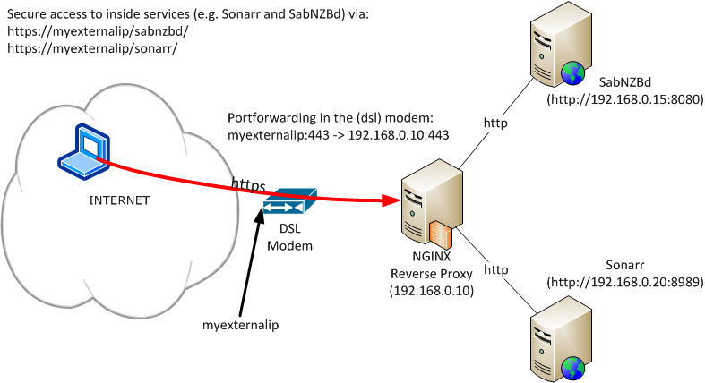

# Issue Summary
Duration of the Outage: The outage started at 12:45 AM and was debugged by 13:45 PM CAT(central African Time).

# Impact:
The site was not listening on port 80, causing all users to be unable to access the website.

# Root Cause:
The Nginx server's site settings were not properly linked. Specifically, the sites-available configuration was not linked to sites-enabled, meaning the configuration was correct but not activated, preventing users from accessing the site.

# Timeline
12:45 AM: The issue was detected when ALX (the platform) attempted to access the website and found it not responsive.

13:00 AM: ALX monitoring alerts indicated that the site was down, and the issue was escalated to me.

13:05 AM: Initial investigation focused on checking the Nginx configuration files for errors, but no errors were found in the configuration itself.

13:15 PM: Further investigation led to checking which service was listening on port 80. It was then discovered that the Nginx configuration in sites-available was not linked to sites-enabled.

13:30 PM: The default configuration was correctly linked in sites-enabled, and Nginx was restarted to apply the changes.

13:45 PM: The issue was resolved, and the site was back online.

# Root Cause and Resolution
# Root Cause:
The root cause was the failure to link the sites-available configuration to sites-enabled, meaning the Nginx server configuration was not active despite being correct.

# Resolution:
The issue was resolved by linking the default configuration from sites-available to sites-enabled and restarting the Nginx service.

# Corrective and Preventative Measures

# Improvements:
Ensuring that after any configuration changes, a script or automated check is run to confirm that the necessary configurations are linked and active.
Improve the monitoring system to detect such issues earlier.

# Task List:

Create and execute a script to link the sites-available configuration to sites-enabled after each configuration change.
Add a monitoring check to ensure that Nginx is correctly listening on port 80.

# Example Script
Here is the script i mentioned to ensure the configuration is always active:

______________________________________________________________
[bash]
(Copy code)
#!/usr/bin/env bash
# Ensure Nginx is properly configured and listening on port 80

cat /etc/nginx/sites-available/default > /etc/nginx/sites-enabled/default
sudo service nginx restart
_______________________________________________________________

# This script ensures that the correct configuration is enabled and restarts Nginx to apply the changes.
the flow diagram

